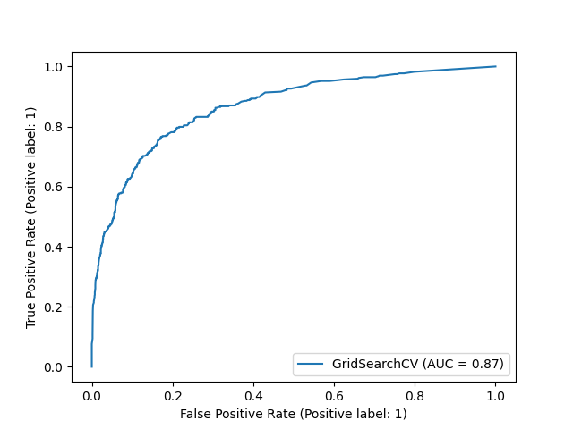

# Creating predictions model

In this document I will walk you trough my process of creating a model. I already explored some of the features but there is still a few things to check like sanity of the information or null values. I'm also going to process the data and then finally, create the model. For this purpose I will use LightGBM which is a highly effective implementation of gradient boosting, optimized for a lower training time.

## Processing the features

First I'm going to take care of transforming the values before plotting them, we'll take care of anything that might be an issue to our model as well as encode categorical values.

### 1) Null values and sanity of the information

```Python
# Null values by feature in percentage
CreditScore        0.0
Geography          0.0
Gender             0.0
Age                0.0
Tenure             0.0
Balance            0.0
NumOfProducts      0.0
HasCrCard          0.0
IsActiveMember     0.0
EstimatedSalary    0.0
Exited             0.0
```

When it comes to null values, the data set seems to be well cleaned already, but just to be sure I'm also going to check if all the data is sane. For balance, estimated salary, credit score, tenure and number of products, all values should be above 0. For the binary features, there should not be any information that is not 1 or 0.

```Python
Column Balance is sane: True
Column CreditScore is sane: True
Column EstimatedSalary is sane: True
Column Tenure is sane: True
Column NumOfProducts is sane: True
Column Exited is sane: True
Column Gender is sane: True
Column HasCrCard is sane: True
Column IsActiveMember is sane: True
```


### 2) Removing outliers

Before going into processing, I want to run one small but very important function. We need to check if the columns contain any outliers that could possibly skew the data in a wrong way. I'm checking every column and their quantiles to find thresholds and check for values that do not fit. I made sure to not check the NumOfProducts column since it only has discrete values.

```python
num_col_names = data.select_dtypes(include=['int64', 'float64']).columns.values
has_outliers(data, num_col_names)

>> No outliers found.
```


### 3) Processing the values

Now it's time to process the numerical and categorical features in an appropriate way. For this task I'm going to create a pipeline that is going to be made of a few steps. For normalizing the features I'm going to use a yeo-johnson power transformer. The categorical features on the other hand will be handled by a one hot encoder since they don't have a lot of unique values.

```python
# Create the pipeline
# Extract the numerical and categorical features into variables
num_cols = data.select_dtypes(include=['int64', 'float64'])
cat_cols = data.select_dtypes(include=['object'])

numerical_transformer = power_transform(method='yeo-johnson')
categorical_transformer = Pipeline(steps=[
    ('onehot', OneHotEncoder(handle_unknown='ignore'))])

# Bundle
preprocessor = ColumnTransformer(
    transformers=[
        ('num', numerical_transformer, num_cols),
        ('cat', categorical_transformer, cat_cols)])

# Create the model
model = LGBMClassifier(
        max_bin=250,
        boosting_type='dart',
        max_depth=10
)

my_pipeline = Pipeline(steps=[('preprocessor', preprocessor),
                              ('model', model)])
```


### 4) Setting up the grid search with cross validation

Grid search is going to help us find the best parameters for our model. In this case, I'm going to choose parameters that should optimize the model for the best accuracy. We don't have to worry about the time complexity too much since the number of features is not high and in the case of gradient boosting it scales with exactly that. Along the grid search, I'm also going to set up a cross validation with 5 folds.

```Python
# Set up grid search
param_grid = {
    'model__n_estimators': [100, 300, 500],
    'model__num_leaves': [30, 150],
    'model__learning_rate': [0.01, 0.001]
}

cv = RepeatedKFold(n_splits=5, n_repeats=5, random_state=24)
gs = GridSearchCV(estimator=pipeline, param_grid=param_grid, cv=cv)
```


## Training the model

It's time to train the model and evaluate its performance. For this task I'm going to use a AUC curve as well as some other metrics. I also want to plot the mean test score from the cross validation. Our final evaluation look like the following:

```Python
              precision    recall  f1-score   support

           0       0.88      0.96      0.92      1607
           1       0.74      0.46      0.57       393

    accuracy                           0.86      2000
   macro avg       0.81      0.71      0.74      2000
weighted avg       0.85      0.86      0.85      2000
```

```Python
# Insights
AUC:  0.8625
Mean CV test score:  [0.84885 0.84875 0.861   0.85595 0.7945  0.7945  0.7945  0.7945 ]
Best estimator:  {'model__learning_rate': 0.01, 'model__n_estimators': 300, 'model__num_leaves': 30}
```




Here we can see the ROC curve. We can see that the model although with fewer features, still performs pretty well and we're easily getting accuracy close to 0.87. I looked into a few models created by other analysts and their scores were around 0.75-0.85 so I will note this result as a success.


